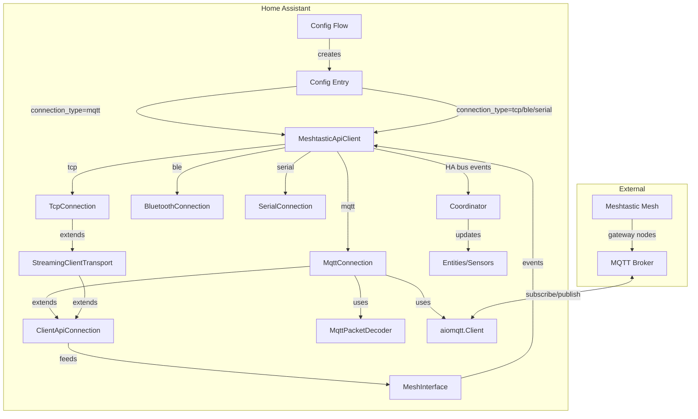
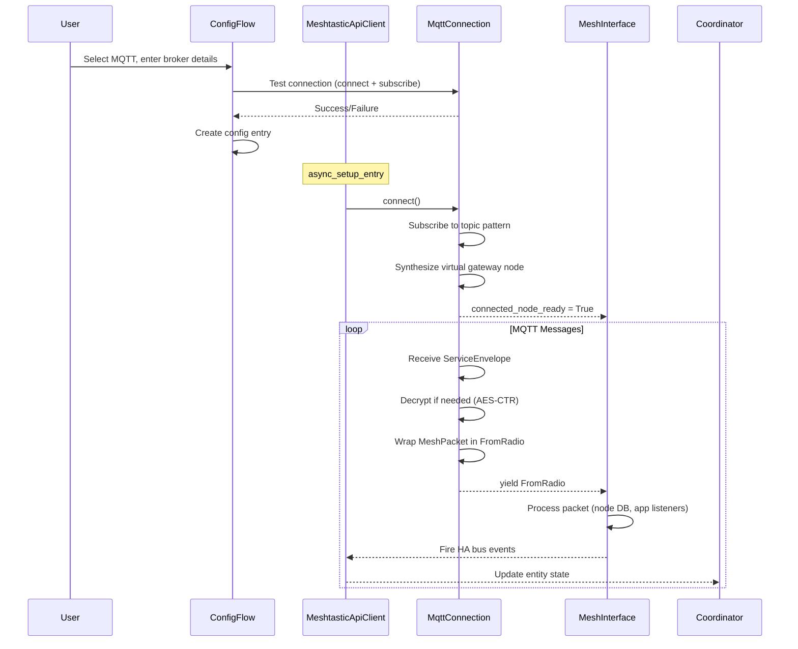

# Design Document: Meshtastic MQTT Integration

## Overview

This design extends the existing Meshtastic Home Assistant custom integration to support MQTT as a fourth connection type alongside TCP, Bluetooth, and Serial. The MQTT connection enables users to monitor Meshtastic mesh network traffic by subscribing to an MQTT broker, decoding encrypted protobuf `ServiceEnvelope` messages, and automatically discovering nodes as Home Assistant devices with full sensor/entity support.

Beyond the core MQTT integration, this design covers the repository infrastructure: OpenAPI/Swagger documentation, Docker containerization and publishing, developer environment tooling, CI/CD pipelines, branching strategy, and repository maintenance.

### Key Design Decisions

1. **`MqttConnection` extends `ClientApiConnection` directly** — not `StreamingClientTransport`. MQTT delivers complete protobuf messages per topic, so byte-stream framing (START1/START2 magic bytes) is unnecessary. The `_packet_stream()` override yields `FromRadio` messages constructed from decoded `ServiceEnvelope` payloads.

2. **Virtual gateway node for MQTT mode** — Since there's no physically connected node, `MqttConnection` synthesizes a virtual gateway node so that `MeshInterface.connected_node_ready()` resolves. The virtual node uses a deterministic ID derived from the broker connection parameters.

3. **`aiomqtt` as the async MQTT library** — Already listed in `manifest.json` requirements and used by `MeshInterface` for MQTT proxy. This avoids adding a new dependency and leverages the existing async pattern.

4. **Decoder adapted from `meshtastic-mqtt-monitor`** — The `MessageDecoder` class is ported into `aiomeshtastic/connection/decoder.py`, using the same AES-CTR decryption logic and protobuf parsing but adapted to yield `FromRadio`-compatible messages instead of `DecodedMessage` dataclasses.

5. **Passive node discovery** — In MQTT mode, nodes are discovered from traffic rather than from an initial config dump. The `request_config()` method returns immediately with minimal synthetic config, and nodes populate the `_node_database` as packets arrive.

6. **Send via MQTT publish** — `send_text`, `send_direct_message`, and `broadcast_channel_message` services work in MQTT mode by constructing `ServiceEnvelope` protobuf messages and publishing them to the appropriate MQTT topic. Request-response services (`request_telemetry`, `request_position`, `request_traceroute`) are unavailable in MQTT-only mode.

## Architecture



### Connection Flow (MQTT Mode)



## Components and Interfaces

### 1. `MqttConnection` (`aiomeshtastic/connection/mqtt.py`)

Extends `ClientApiConnection` directly. Core responsibilities:

- **`_connect()`**: Creates `aiomqtt.Client`, connects to broker, subscribes to topic pattern.
- **`_disconnect()`**: Unsubscribes and closes the MQTT client.
- **`_packet_stream()`**: Async generator that receives MQTT messages, decodes them via `MqttPacketDecoder`, wraps valid `MeshPacket`s in `FromRadio` messages, and yields them.
- **`_send_packet()`**: Constructs a `ServiceEnvelope` from a `ToRadio` packet and publishes it to the appropriate MQTT topic.
- **`request_config()`**: Override that immediately synthesizes minimal config (virtual `MyNodeInfo`, empty channels, `config_complete_id`) and returns `True`.
- **Reconnection**: Uses `aiomqtt`'s built-in reconnection with exponential backoff (1s to 60s).

```python
class MqttConnection(ClientApiConnection):
    def __init__(
        self,
        broker_host: str,
        broker_port: int = 1883,
        username: str | None = None,
        password: str | None = None,
        use_tls: bool = False,
        topic_pattern: str = "msh/US/2/e/#",
        channel_keys: dict[str, str] | None = None,
        region: str = "US",
    ) -> None: ...
    
    async def _connect(self) -> None: ...
    async def _disconnect(self) -> None: ...
    async def _packet_stream(self) -> AsyncIterable[mesh_pb2.FromRadio]: ...
    async def _send_packet(self, packet: bytes) -> bool: ...
    
    @property
    def is_connected(self) -> bool: ...
```

### 2. `MqttPacketDecoder` (`aiomeshtastic/connection/decoder.py`)

Stateless decoder adapted from `meshtastic-mqtt-monitor/src/decoder.py`. Handles:

- `ServiceEnvelope` parsing with fallback to direct `MeshPacket` parsing
- AES-CTR decryption with channel key lookup, nonce construction, and key padding/expansion
- Channel name extraction from MQTT topic strings
- JSON message parsing for `json`-format topics

```python
class MqttPacketDecoder:
    def __init__(self, channel_keys: dict[str, str]) -> None: ...
    
    def decode_to_mesh_packet(
        self, topic: str, payload: bytes
    ) -> mesh_pb2.MeshPacket | None: ...
    
    def decrypt_payload(
        self, encrypted: bytes, channel: str, packet_id: int, from_node_id: int
    ) -> bytes | None: ...
    
    def extract_channel_from_topic(self, topic: str) -> str: ...
    
    def prepare_key(self, raw_key: bytes) -> bytes: ...
    
    def build_nonce(self, packet_id: int, from_node_id: int) -> bytes: ...
```

### 3. `MqttMessagePublisher` (within `MqttConnection`)

Handles outbound message construction for send services:

- Builds `ServiceEnvelope` protobuf from `ToRadio` packets
- Constructs MQTT topic from region, channel, and gateway ID
- Publishes via the existing `aiomqtt.Client`

### 4. Config Flow Extensions (`config_flow.py`)

New steps added to the existing `ConfigFlow`:

- **`async_step_manual_mqtt()`**: Form for MQTT broker settings (host, port, username, password, TLS, topic pattern)
- **`async_step_mqtt_channels()`**: Dynamic form for adding channel name + encryption key pairs
- **`async_step_mqtt_test()`**: Test connection validation

The `async_step_user()` menu gains an `"manual_mqtt"` option.

### 5. `MeshtasticApiClient` Extensions (`api.py`)

The `__init__` method gains an MQTT branch:

```python
elif connection_type == ConnectionType.MQTT.value:
    connection = MqttConnection(
        broker_host=data[CONF_CONNECTION_MQTT_HOST],
        broker_port=data[CONF_CONNECTION_MQTT_PORT],
        username=data.get(CONF_CONNECTION_MQTT_USERNAME),
        password=data.get(CONF_CONNECTION_MQTT_PASSWORD),
        use_tls=data.get(CONF_CONNECTION_MQTT_TLS, False),
        topic_pattern=data.get(CONF_CONNECTION_MQTT_TOPIC, "msh/US/2/e/#"),
        channel_keys=data.get(CONF_CONNECTION_MQTT_CHANNEL_KEYS, {}),
    )
```

### 6. `async_setup_entry` Extensions (`__init__.py`)

For MQTT mode:
- Skip the node selection step (no `CONF_OPTION_FILTER_NODES` required)
- Auto-discover all nodes from MQTT traffic
- Create a virtual gateway device
- The coordinator's `_async_update_data` includes all discovered nodes (no filter)

### 7. Constants Extensions (`const.py`)

```python
class ConnectionType(enum.StrEnum):
    TCP = "tcp"
    BLUETOOTH = "bluetooth"
    SERIAL = "serial"
    MQTT = "mqtt"

# MQTT config keys
CONF_CONNECTION_MQTT_HOST = "mqtt_host"
CONF_CONNECTION_MQTT_PORT = "mqtt_port"
CONF_CONNECTION_MQTT_USERNAME = "mqtt_username"
CONF_CONNECTION_MQTT_PASSWORD = "mqtt_password"
CONF_CONNECTION_MQTT_TLS = "mqtt_tls"
CONF_CONNECTION_MQTT_TOPIC = "mqtt_topic"
CONF_CONNECTION_MQTT_CHANNEL_KEYS = "mqtt_channel_keys"
CONF_CONNECTION_MQTT_REGION = "mqtt_region"
```

### 8. Repository Infrastructure Components

| Component | File(s) | Purpose |
|-----------|---------|---------|
| OpenAPI Spec | `docs/api/openapi.yaml` | Service endpoints, MQTT schemas, event payloads |
| Swagger UI | `docs/api/index.html` | Interactive API documentation viewer |
| Dockerfile | `Dockerfile` | Multi-stage build, HA + integration |
| Docker Compose (dev) | `docker-compose.yaml` | Dev environment with volume mounts |
| Docker Compose (prod) | `docker-compose.prod.yaml` | Production deployment |
| CI Pipeline | `.github/workflows/ci.yml` | Tests, lint, type check, coverage |
| Docker Publish | `.github/workflows/docker-publish.yml` | Build + push to Docker Hub |
| Renovate | `renovate.json` | Automated dependency updates |
| Issue Templates | `.github/ISSUE_TEMPLATE/` | Bug, feature, security templates |
| PR Template | `.github/PULL_REQUEST_TEMPLATE.md` | Contribution guide |
| Makefile | `Makefile` | Dev automation targets |
| Devcontainer | `.devcontainer/devcontainer.json` | VS Code dev environment |
| VS Code Config | `.vscode/launch.json` | Debug configurations |
| Documentation | `docs/user-guide.md`, `docs/developer-guide.md`, `docs/features.md` | User and developer docs |

## Data Models

### MQTT Config Entry Data

```python
{
    "connection_type": "mqtt",
    "mqtt_host": "mqtt.meshtastic.org",
    "mqtt_port": 1883,
    "mqtt_username": "meshdev",        # optional
    "mqtt_password": "large4cats",     # optional
    "mqtt_tls": False,
    "mqtt_topic": "msh/US/2/e/#",
    "mqtt_region": "US",
    "mqtt_channel_keys": {
        "LongFast": "AQ==",           # base64-encoded AES key
        "ShortSlow": "custom_key_b64"
    }
}
```

### Virtual Gateway Node (synthesized for MQTT mode)

```python
{
    "num": <deterministic_hash_of_broker_params>,
    "user": {
        "id": "!mqtt0001",
        "longName": "MQTT Gateway (mqtt.meshtastic.org)",
        "shortName": "MQTT",
        "hwModel": "PORTDUINO",
        "macaddr": <synthetic_mac>
    }
}
```

### Decoded MQTT Packet Flow

```
MQTT Message (topic + binary payload)
  → ServiceEnvelope (mqtt_pb2)
    → MeshPacket (mesh_pb2)
      → [if encrypted] AES-CTR decrypt → Data (mesh_pb2)
      → [if decoded] Data directly
        → FromRadio wrapper (mesh_packet field set)
          → MeshInterface packet processing pipeline
```

### AES-CTR Nonce Construction

```
Nonce (16 bytes) = packet_id.to_bytes(8, "little") + from_node_id.to_bytes(8, "little")
```

### Key Preparation Rules

| Input Key Length | Action |
|-----------------|--------|
| 1 byte, value `0x01` | Expand to default key: `base64.b64decode("1PG7OiApB1nwvP+rz05pAQ==")` |
| < 16 bytes | Pad with `0x00` to 16 bytes |
| 16 bytes | Use as-is (AES-128) |
| 17–31 bytes | Pad with `0x00` to 32 bytes |
| 32 bytes | Use as-is (AES-256) |
| > 32 bytes | Truncate to 32 bytes |

### MQTT Topic Structure

```
msh/{region}/2/e/{channel_name}[/{gateway_id}]
msh/{region}/{area}/{network}/2/e/{channel_name}[/{gateway_id}]
msh/{region}/2/json/{channel_name}[/{gateway_id}]
```

### ServiceEnvelope Protobuf Structure (for publishing)

```protobuf
message ServiceEnvelope {
    MeshPacket packet = 1;
    string channel_id = 2;   // channel name
    string gateway_id = 3;   // gateway node ID string
}
```

### Outbound Message Topic Construction

```
topic = f"msh/{region}/2/e/{channel}/{gateway_id}"
```


## Correctness Properties

*A property is a characteristic or behavior that should hold true across all valid executions of a system — essentially, a formal statement about what the system should do. Properties serve as the bridge between human-readable specifications and machine-verifiable correctness guarantees.*

### Property 1: ServiceEnvelope round-trip

*For any* valid `MeshPacket`, wrapping it in a `ServiceEnvelope` with a channel_id and gateway_id, serializing to bytes, and then parsing those bytes back through the decoder should produce an equivalent `MeshPacket` with the same `from`, `to`, `id`, `channel`, and `decoded.payload` fields.

**Validates: Requirements 2.3, 7.2, 7.6**

### Property 2: Direct MeshPacket fallback parsing

*For any* valid `MeshPacket` serialized directly (not wrapped in a `ServiceEnvelope`), the decoder should still successfully extract an equivalent `MeshPacket`.

**Validates: Requirements 7.3**

### Property 3: AES-CTR encryption/decryption round-trip

*For any* plaintext byte sequence, packet ID (uint32), sender node ID (uint32), and valid AES key (16 or 32 bytes), encrypting the plaintext with AES-CTR using the constructed nonce and then decrypting with the same key and nonce should produce the original plaintext.

**Validates: Requirements 2.4, 8.1, 8.7**

### Property 4: Key preparation produces valid AES key length

*For any* raw key byte sequence of arbitrary length, the `prepare_key` function should produce a key of exactly 16 or 32 bytes. Specifically: keys ≤16 bytes (after 0x01 expansion) produce 16-byte keys, keys of 17–32 bytes produce 32-byte keys, and keys >32 bytes produce 32-byte keys.

**Validates: Requirements 8.3, 8.4, 8.5**

### Property 5: Nonce construction produces 16 bytes with correct layout

*For any* packet ID (uint32) and sender node ID (uint32), the constructed nonce should be exactly 16 bytes where the first 8 bytes equal `packet_id.to_bytes(8, "little")` and the last 8 bytes equal `from_node_id.to_bytes(8, "little")`.

**Validates: Requirements 8.1**

### Property 6: Channel name extraction from MQTT topics

*For any* MQTT topic string containing a type indicator (`e`, `c`, or `json`) followed by a channel name segment, the `extract_channel_from_topic` function should return that channel name segment. This holds regardless of whether the topic has the standard format (`msh/{region}/2/e/{channel}`), extended format (`msh/{region}/{area}/{network}/2/e/{channel}`), or JSON format (`msh/{region}/2/json/{channel}`).

**Validates: Requirements 9.1, 9.2, 9.3**

### Property 7: Latitude/longitude fixed-point conversion

*For any* integer value `latitudeI` or `longitudeI`, the converted floating-point value should equal the integer multiplied by 1e-7, and the result should be within the valid geographic range (latitude: -90 to 90, longitude: -180 to 180) when the input integer is within the corresponding valid range.

**Validates: Requirements 3.6**

### Property 8: Node database update from decoded packets

*For any* decoded `MeshPacket` with portnum `NODEINFO_APP`, `POSITION_APP`, or `TELEMETRY_APP` and a valid sender node ID, after processing the packet, the node database should contain an entry for that node ID with the relevant fields from the packet payload.

**Validates: Requirements 3.1, 3.2, 3.3**

### Property 9: Stub node creation for unknown senders

*For any* node ID not currently in the node database, when a packet from that node ID is processed, the node database should contain a new entry with `num` equal to the node ID and a `user.id` field equal to the hex-formatted node ID (`!{node_id:08x}`).

**Validates: Requirements 3.5**

### Property 10: Text message event contains correct fields

*For any* decoded `MeshPacket` with portnum `TEXT_MESSAGE_APP`, the fired Home Assistant event should contain the UTF-8 decoded payload as the message text, the sender's node ID as `from`, and the destination node ID or broadcast indicator as `to`.

**Validates: Requirements 3.4**

### Property 11: Connection type routing

*For any* config entry data with `connection_type` set to one of `tcp`, `bluetooth`, `serial`, or `mqtt`, the `MeshtasticApiClient` should instantiate the corresponding connection class (`TcpConnection`, `BluetoothConnection`, `SerialConnection`, or `MqttConnection` respectively).

**Validates: Requirements 5.3**

### Property 12: MQTT broker validation

*For any* broker host string that is empty, the config flow validation should reject the input. *For any* broker port integer outside the range 1–65535, the config flow validation should reject the input.

**Validates: Requirements 1.6**

### Property 13: Invalid base64 channel key rejection

*For any* string that is not valid base64 encoding, the config flow validation should reject it when provided as a channel key.

**Validates: Requirements 6.4**

### Property 14: Device identifier consistency across connection types

*For any* Meshtastic node number seen by both a device-based connection and an MQTT-based connection, the Home Assistant device registry should contain exactly one device with identifier `(meshtastic, {node_num})`.

**Validates: Requirements 5.2**

### Property 15: JSON message field extraction

*For any* valid JSON payload containing `type`, `from`, `to`, and `payload` fields received on a `json`-format MQTT topic, the decoder should extract the packet type, sender, destination, and payload fields correctly.

**Validates: Requirements 7.5**

### Property 16: FromRadio output validity

*For any* valid MQTT message that the decoder successfully processes (either from a ServiceEnvelope or direct MeshPacket), the yielded `FromRadio` message should have the `packet` field set with the decoded `MeshPacket`.

**Validates: Requirements 2.2, 2.6**

### Property 17: Device model from hwModel

*For any* `NODEINFO_APP` packet containing a non-zero `hwModel` field, the corresponding Home Assistant device should have its model set to the hardware model name matching that `hwModel` value.

**Validates: Requirements 4.5**

## Error Handling

### MQTT Connection Errors

| Error Scenario | Handling |
|---------------|----------|
| Broker unreachable | `_connect()` raises `ClientApiConnectFailedError`, caught by `ConfigEntryNotReady` in `async_setup_entry` for automatic retry |
| Authentication failure (MQTT rc=4,5) | Log error, do not retry (permanent failure), raise `ClientApiConnectFailedError` |
| Connection lost during operation | `aiomqtt` raises `MqttError`, caught in `_packet_stream()`, triggers reconnection via `ClientApiConnection.reconnect()` |
| Subscription failure | Log warning, retry on next reconnect |

### Decoding Errors

| Error Scenario | Handling |
|---------------|----------|
| Invalid protobuf (not ServiceEnvelope or MeshPacket) | Log warning at debug level, discard message, continue processing |
| Decryption failure (wrong key, corrupted data) | Log debug message, skip packet, continue processing |
| Missing channel key | Log debug message noting the channel, skip packet |
| Invalid JSON on json topic | Log warning, discard message |
| Protobuf field access error | Catch `Exception`, log warning, skip packet |

### Service Errors (MQTT Mode)

| Service | MQTT Mode Behavior |
|---------|-------------------|
| `send_text` | Construct ServiceEnvelope, publish to MQTT topic. Raise `MeshtasticApiClientError` if MQTT client not connected. |
| `send_direct_message` | Same as `send_text` with specific `to` node. |
| `broadcast_channel_message` | Same as `send_text` with broadcast address. |
| `request_telemetry` | Raise `MeshtasticApiClientError("Not supported in MQTT mode")` |
| `request_position` | Raise `MeshtasticApiClientError("Not supported in MQTT mode")` |
| `request_traceroute` | Raise `MeshtasticApiClientError("Not supported in MQTT mode")` |

### Config Flow Errors

| Error Scenario | Handling |
|---------------|----------|
| Empty broker host | Show validation error on host field |
| Invalid port (0, >65535) | Show validation error on port field |
| Invalid base64 channel key | Show validation error on key field |
| Test connection timeout (>10s) | Show "cannot_connect" error |
| Test connection auth failure | Show specific auth error message |

## Testing Strategy

### Property-Based Testing

The integration will use **Hypothesis** as the property-based testing library for Python. Each correctness property from the design document will be implemented as a single Hypothesis test with a minimum of 100 examples per test.

Each property test must be tagged with a comment referencing the design property:
```python
# Feature: meshtastic-mqtt-integration, Property 1: ServiceEnvelope round-trip
```

**Property tests to implement:**

1. **ServiceEnvelope round-trip** (Property 1) — Generate random MeshPackets, wrap in ServiceEnvelope, serialize, decode, verify equivalence.
2. **Direct MeshPacket fallback** (Property 2) — Generate random MeshPackets, serialize directly, verify decoder extracts them.
3. **AES-CTR round-trip** (Property 3) — Generate random plaintext, keys, packet IDs, node IDs; encrypt then decrypt; verify identity.
4. **Key preparation length** (Property 4) — Generate random byte sequences of various lengths; verify output is 16 or 32 bytes.
5. **Nonce construction** (Property 5) — Generate random uint32 pairs; verify nonce is 16 bytes with correct byte layout.
6. **Channel extraction** (Property 6) — Generate random topic strings with type indicators; verify correct channel extraction.
7. **Lat/lon conversion** (Property 7) — Generate random integers in valid range; verify float conversion accuracy.
8. **Node database update** (Property 8) — Generate random packets with known portnums; verify node database contains correct fields.
9. **Stub node creation** (Property 9) — Generate random node IDs; verify stub entries are created correctly.
10. **Text message events** (Property 10) — Generate random text packets; verify event fields match.
11. **Connection type routing** (Property 11) — For each connection type, verify correct class instantiation.
12. **Broker validation** (Property 12) — Generate random strings/ints; verify validation accepts/rejects correctly.
13. **Base64 key validation** (Property 13) — Generate random non-base64 strings; verify rejection.
14. **Device identifier consistency** (Property 14) — Generate random node numbers; verify single device per node.
15. **JSON message extraction** (Property 15) — Generate random JSON payloads; verify field extraction.
16. **FromRadio output validity** (Property 16) — Generate random valid MQTT messages; verify FromRadio has packet field set.
17. **Device model from hwModel** (Property 17) — Generate random hwModel values; verify device model mapping.

### Unit Testing

Unit tests complement property tests by covering specific examples, integration points, and edge cases:

- **Config flow happy path**: MQTT setup wizard end-to-end with mocked broker
- **Config flow error cases**: Invalid inputs, connection failures, auth failures
- **Options flow**: Edit MQTT settings, add/remove channel keys
- **MqttConnection lifecycle**: connect → subscribe → receive → disconnect
- **Decoder edge cases**: Empty payload, status messages on `/stat/` topics, oversized packets
- **Key expansion**: The `0x01` → default key expansion specifically
- **Virtual gateway node**: Verify synthesized node has correct structure
- **Service routing**: send_text works in MQTT mode, request_* raises errors
- **Dual-mode coexistence**: Two config entries (TCP + MQTT) for same node
- **Coordinator updates**: Verify entity state updates from MQTT-sourced events
- **Reconnection**: Verify exponential backoff timing (1s, 2s, 4s, ..., 60s cap)

### Test Configuration

```python
# conftest.py
from hypothesis import settings

settings.register_profile("ci", max_examples=200)
settings.register_profile("dev", max_examples=100)
settings.load_profile("dev")
```

### Test File Organization

```
tests/
├── test_mqtt_connection.py          # MqttConnection unit + property tests
├── test_mqtt_decoder.py             # MqttPacketDecoder unit + property tests
├── test_mqtt_encryption.py          # AES-CTR encryption property tests
├── test_mqtt_topic_parsing.py       # Topic parsing property tests
├── test_mqtt_config_flow.py         # Config flow unit tests
├── test_mqtt_api_client.py          # API client routing + service tests
├── test_mqtt_node_discovery.py      # Node database + entity creation tests
├── test_mqtt_dual_mode.py           # Dual-mode coexistence tests
└── conftest.py                      # Shared fixtures, Hypothesis settings
```
